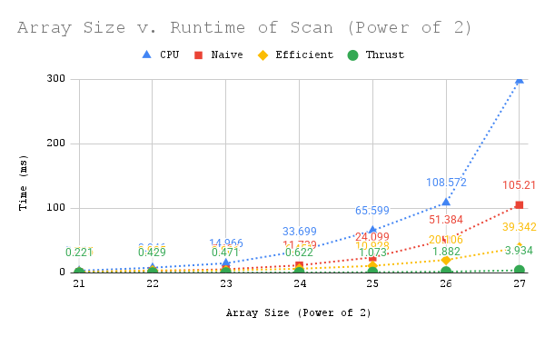
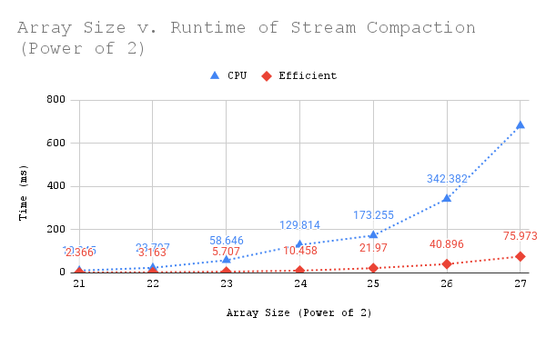

CUDA Stream Compaction
======================

**University of Pennsylvania, CIS 565: GPU Programming and Architecture, Project 2**

* Jacqueline (Jackie) Li
  * [LinkedIn](https://www.linkedin.com/in/jackie-lii/), [personal website](https://sites.google.com/seas.upenn.edu/jacquelineli/home), [Instagram](https://www.instagram.com/sagescherrytree/), etc.
* Tested on: Windows 10, 11th Gen Intel(R) Core(TM) i7-11800H @ 2.30GHz, NVIDIA GeForce RTX 3060 Laptop GPU (6 GB)

# Program Overview

I do not know what I am doing send help pls.

This is a stream compaction program which has a CPU, Naive, and Efficient implementation of the stream compaction algorithm. 

Extra credit implemented: Radix Sort.

#### CPU Implementation

Idea: For the scan algorithm, launch one thread to linearly calculate a prefix sum. Then, in the stream compaction portion, use a flag to indicate which items are to be included in the final array, run scan, then add the data corresponding to the scanned array indices to the output array. 

For this version of stream compaction, the include condition is if element of array is not 0.

Pseudocode:

```
# Scan.
Set first element of out array to 0.

for i from 1 -> size of array do:
  # Accumulate out with last value of in, exclusive scan.
  out[i] = out[i - 1] + in[i - 1]

# Compact without scan.

Initialize counter.
for i from 0 -> n do:
  if in[i] != 0 (condition) :
    Set out array's data at the counter index to in[i]
    The reason to do this is b/c counter keeps track of when the element passes the filtering condition. 
    counter++

# Compact with scan.
Calculate flag array: 1 for item to be included, 0 o.w.

Call scan function on flag array.

Scatter step:
Initialize counter. 
for i from 0 -> n do:
  if flag[i] == 1 (means elem included):
    Set out array's data at scanned[i] index to in[i].
    Because we run scan on the flag array, scanned array will hold the new indices of filtered array with given condition.
    counter++
```

Runtime: O(n)

#### Naive Implementation

Idea: Divide each summation into parallel processes which propagate each sum of two numbers down to the next process. Each summation is now a partial sum which will calculate a sum with its 2^(d-1)th neighbour. 

```
Create double buffers to ping pong values as parallel sum is computed by layer

for d from 1 -> log_2(n) do:
  Get offset of nearest neighbour to second power
  offset = 1 << (d - 1)
  if current thread index > offset (in neighbouring thread):
    out[index] = in[index] + in[index - offset]
    Take partial sum of current point and neighbour thread point to obtain out value
  else:
    out[index] = in[index]
```

Runtime: O(nlog_2(n))

#### Efficient Implementation

Idea: Use a balanced binary tree to conduct scanning, implementing an upsweep (parallel reduction) then a downsweep to build the scan in place using partial sums. The downsweep takes the n/2 sum to the left and the n sum on the right and accumulates through ceil(log_2(n)) levels. Integrate that into stream compaction by using the same three step process described in naive, but run on kernels instead (flag, scan, scatter). 

```
Initialize single buffer

# Upsweep.
Parallel reduction.
for d from 0 -> ceil(log_2(n)) do:
  Multiply k by 1 << (d + 1)
  slideR = 1 << (d + 1)
  slideL = 1 << (d)
  Sum in[k + slideR - 1] with in[k + slideL]

# Downsweep.
for d from ceil(log_2(n)) -> 0 do:
  Multiply k by 1 << (d + 1)
  Each parent node propagates sum down to left child
  Each right child inherits left child's old value + parent node value

# Stream compaction with efficient scan.
Use kernel function to map all elements according to provided condition.

Call scan function to obtain a scanned array.

Call scatter to accumulate scanned and flagged arrays, and compute final output array.
```

Runtime: O(n)

#### Thrust Implementation

This implementation just calls the exclusive scan algorithm from the thrust API, which we mainly do to compare the runtime with the other methods.

#### Extra Credit: Radix Sort

Idea: Keep partitioning data by bits, from least significant bit to most significant bit. On each pass, divide element by two groups - 0 on the left and 1 on the right. Use the process for stream compaction (flag, scan, scatter) to rearrange the elements. By the end, you should end up with a sorted array based on the bits. 

```
For each tile of number in an array:

Create buffers for array passes.
- input, output
- b: boolean flag array for current bit
- e: inverse of b
- f: exclusive scan result on e
- t: addresses for values that pass condition

for bit from 0 -> (sizeof(int)*8 - 1): 

  # Compute inverse bits
  For each element in parallel:
    b[i] = (idata[i] >> bit) & 1
    e[i] = 1 - b[i]

  # Scan
  Run exclusive scan on f

  # Calculate total false
  totalFalse = total numnber of zeroes

  For each element in parallel, i is index:
    t[i] = i - f[i] + totalFalse 

  # Use boolean flag array and scanned array to update output
  For each element in parallel, i is index:
    if b[i] == 0:
       odata[f[i]] = idata[i]
    else:
       odata[t[i]] = idata[i]

  Swap(idata, odata)
```

Runtime: O(n) or O(n * 32)

## Output of Scan and Stream Compaction Tests (Array Size = 2^22)

```
****************
** SCAN TESTS **
****************
    [  29  20   9  28   3  43  38  45  37  31  14  45  49 ...  19   0 ]
==== cpu scan, power-of-two ====
   elapsed time: 7.0663ms    (std::chrono Measured)
    [   0  29  49  58  86  89 132 170 215 252 283 297 342 ... 102694886 102694905 ]
==== cpu scan, non-power-of-two ====
   elapsed time: 6.5774ms    (std::chrono Measured)
    [   0  29  49  58  86  89 132 170 215 252 283 297 342 ... 102694796 102694834 ]
    passed
==== naive scan, power-of-two ====
   elapsed time: 2.92838ms    (CUDA Measured)
    passed
==== naive scan, non-power-of-two ====
   elapsed time: 2.66061ms    (CUDA Measured)
    passed
==== work-efficient scan, power-of-two ====
   elapsed time: 2.56464ms    (CUDA Measured)
    passed
==== work-efficient scan, non-power-of-two ====
   elapsed time: 2.60512ms    (CUDA Measured)
    passed
==== thrust scan, power-of-two ====
   elapsed time: 0.272416ms    (CUDA Measured)
    passed
==== thrust scan, non-power-of-two ====
   elapsed time: 0.299904ms    (CUDA Measured)
    passed

*****************************
** STREAM COMPACTION TESTS **
*****************************
    [   1   2   1   0   1   3   0   1   1   3   2   3   3 ...   3   0 ]
==== cpu compact without scan, power-of-two ====
   elapsed time: 9.7757ms    (std::chrono Measured)
    [   1   2   1   1   3   1   1   3   2   3   3   1   2 ...   1   3 ]
    passed
==== cpu compact without scan, non-power-of-two ====
   elapsed time: 9.499ms    (std::chrono Measured)
    [   1   2   1   1   3   1   1   3   2   3   3   1   2 ...   2   1 ]
    passed
==== cpu compact with scan ====
   elapsed time: 22.9635ms    (std::chrono Measured)
    [   1   2   1   1   3   1   1   3   2   3   3   1   2 ...   1   3 ]
    passed
==== work-efficient compact, power-of-two ====
   elapsed time: 4.1111ms    (CUDA Measured)
    passed
==== work-efficient compact, non-power-of-two ====
   elapsed time: 5.43821ms    (CUDA Measured)
    passed

*****************************
** RADIX SORT TESTS **
*****************************
    [ 10529 11470 28509 11228 25353 19443 10388 17545 13137 22131 14414 9195 5299 ... 25219   0 ]
==== radix sort ====
   elapsed time: 158.514ms    (CUDA Measured)
    passed
```

## Runtime and Performance Analysis

For the first set of runtime analysis tests, I varied the size of the array and plotted the runtime of each method against each other. I hypothesise that the CPU version will take exponentially more time than the naive and efficient methods because the CPU version only launches one thread at a time to calculate, while at least naive and efficient algorithm engage in parallel processing.

### Size of Array v. Runtime of Scan Method

**blockSize = 128, array size power of 2**

| Array Size     |  CPU  | Naive | Efficient | Thrust |
|----------------|-------|-------|-----------|--------|
| 21             |3.424  | 1.434 |   1.735   | 0.221  |
| 22 (default)   |8.046  | 2.875 |   3.905   | 0.429  |
| 23             |14.966 | 5.634 |   3.861   | 0.471  |
| 24             |33.699 | 11.739|   6.451   | 0.622  |
| 25             |65.599 | 24.099|   10.928  | 1.073  |
| 26             |108.572| 51.384|   20.106  | 1.882  |
| 27             |298.015| 105.21|   39.342  | 3.934  |

|  |
|:--:|

**blockSize = 128, array size non power of 2**

| Array Size     |  CPU  | Naive | Efficient | Thrust |
|----------------|-------|-------|-----------|--------|
| 21             |3.223  | 1.304 |   1.923   | 0.302  |
| 22 (default)   |8.760  | 2.799 |   3.272   | 0.351  |
| 23             |15.419 | 5.486 |   3.585   | 0.521  |
| 24             |38.369 | 11.443|   7.157   | 1.502  |
| 25             |59.687 | 24.553|   10.668  | 1.013  |
| 26             |105.816| 50.069|   20.176  | 2.049  |
| 27             |204.977| 105.09|   38.462  | 3.665  |

|  |
|:--:|

From these two graphs, we can clearly see that the timing for the CPU methodology increases exponentially as the array size increases, which is to be expected because for larger data values CPU memory will spill over L1/L2 cache, making the sequential loop take more time to retrieve values. 

In the naive GPU implementation, a kernel is launched every loop for log(n) times, where n is the length of the array. We can see compared to efficient, naive actually beats it for smaller array sizes, because it requires fewer threads. Naive will launch in total log(n) kernels, and its memory is less coalesced because as offset increases, it will take longer to access memory that is further away (i.e. neighbour is a lot further, so takes more time to access neighbour memory even if the computation still takes minimal time).

In the efficient implementation, we launch a kernel each for upsweep and downsweep, for d from 0 -> log_ceil2(n) times. So in total, 2 * log(n) kernels are launched. The reason why efficient is faster than naive though even though it launches more kernels is because naive has several issues, including but not limited to idle threads as the offset increases, reading and writing overlapping values, and that memory is less coalesced because every thread reads from an increasingly distant neighbour. Hence, efficient implementation runtime will ultimately trump both CPU and naive for larger array sizes, because upsweep and downsweep only touch each element log(n) times, leading to less idle threads and memory that is more coalesced, meaning threads can access consecutive memory threads, hence making runtime faster.

We can see that the fastest implementation of scan is actually, in fact, thrust implementation. Likely this implies further optimisation of the number of kernel calls from the efficient method, perhaps approaching minimal number of possible kernel calls. 

Another optimisation that was made with the suggestion from a classmate was to divide the n value passed into the upsweep and downsweep kernels by the stride (which is bitshift of 1 << d + 1). This is due to the fact that if I used my previous method of multiplying k (which is my thread index for blocksize) by the stride each time in the kernel then compare that value to ensure it does not go out of bounds, for sufficiently large values of the array (e.g. 2^26), resulting k will be a negative number, which will cause an illegal access error after being compared to n. Now, with the modified n and doing the multiplication with stride AFTER the n bounds check, I can reach higher bounds of array size. 

### Size of Array v. Runtime of Stream Compaction Method

**blockSize = 128, array size power of 2**

| Array Size     | CPU   | Efficient |
|----------------|-------|-----------|
| 21             |10.845 |   2.366   |
| 22 (default)   |23.797 |   3.163   |
| 23             |58.646 |   5.707   |
| 24             |129.814|   10.458  |
| 25             |173.255|   21.970  |
| 26             |342.382|   40.896  |
| 27             |681.781|   75.973  |

|  |
|:--:|

Using the runtime analysis for scan, we can hence see that the trend persists with the runtime of the entire stream compaction algorithm. CPU runtime will increase exponentially with the increase in array size, while efficient's timing increase remains much faster due to many of the reasons listed above, including but not limited to its optimised memory coalescing, parallel execution of scanning and scattering, and 2*log(n) kernel launches for upsweep and downsweep.

### Blocksize v. Runtime of Scan Method

**size of array = 2^22, array size power of 2**

| Blocksize      | Naive | Efficient |
|----------------|-------|-----------|
| 64             | 2.844 |   2.471   |
| 128 (default)  | 2.875 |   3.905   |
| 256            | 2.794 |   2.634   |
| 512            | 2.797 |   2.513   |

|  |
|:--:|

**size of array approx 2^22, array size non power of 2**

| Blocksize      | Naive | Efficient |
|----------------|-------|-----------|
| 64             | 2.700 |   2.457   |
| 128 (default)  | 2.799 |   3.272   |
| 256            | 2.690 |   2.634   |
| 512            | 2.660 |   2.309   |

|  |
|:--:|

In terms of blocksize, it is also quite interesting to see how differently the two methods perform. Because Naive utilizes repeated kernel launches, its runtime is not very affected by the variance in blocksize, as shown by the timing data obtained above. However, the same cannot be said about Efficient, and actually we see its runtime decrease as the blocksize increases. This is due to the fact that Efficient method utilizes more optimized memory coalescing, with the blocksize to run each process on being larger. So in fact, Efficient scan is proven to be better for larger blocksizes.

### Size of Array v. Runtime of Radix Sort

**blockSize = 128, array size power of 2**

| Array Size     |  Radix  |
|----------------|---------|
| 21             | 65.865  |
| 22 (default)   | 120.236 |
| 23             | 189.99  |
| 24             | 338.039 |
| 25             | 683.965 |
| 26             | 1338.53 |
| 27             | 2610.42 |

|  |
|:--:|

### Blocksize v. Runtime of Radix Sort

**size of array = 2^22, array size power of 2**

| Blocksize      | Radix  |
|----------------|--------|
| 64             | 115.803|
| 128 (default)  | 120.236|
| 256            | 106.817|
| 512            | 105.16 |

|  |
|:--:|

Radix sort uses multiple calls to efficient scan to sort an array based on Least Significant Bit to Most Significant Bit. Because scan is called for every bit and we are sorting with integers (max len 32), the runtime is O(n * k), where k = 32. The arrays b, e, and f which are used in memory as well are also coalesced, contributing to its efficiency. In terms of blocksize, because Radix sort utlizes the above tested efficient scanning algorithm to do its scanning, naturally it too will see the same trend of better runtime for a larger blocksize.
